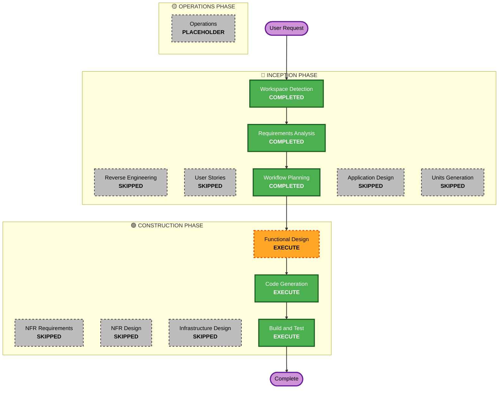

# Execution Plan

## Detailed Analysis Summary

### Transformation Scope (Brownfield Only)

- **N/A** — Greenfield project

### Change Impact Assessment

- **User-facing changes**: Yes — new DSL API for Nim developers
- **Structural changes**: N/A (new project)
- **Data model changes**: No
- **API changes**: Yes — public API of the NimUI library
- **NFR impact**: Minimal — MVP phase, NFRs deferred

### Risk Assessment

- **Risk Level**: Low — well-understood pattern (DSL → HTML/CSS), no existing
  system impact
- **Rollback Complexity**: N/A (greenfield)
- **Testing Complexity**: Simple — unit tests for macro output and HTML
  generation

## Phase Determination Rationale

| Phase                     | Decision   | Rationale                                                            |
| ------------------------- | ---------- | -------------------------------------------------------------------- |
| **Reverse Engineering**   | ❌ Skip    | Greenfield — no existing codebase                                    |
| **User Stories**          | ❌ Skip    | Single developer, clear MVP scope, no multiple personas              |
| **Application Design**    | ❌ Skip    | Single component library — no complex service/component architecture |
| **Units Generation**      | ❌ Skip    | Single unit of work: the NimUI library                               |
| **Functional Design**     | ✅ Execute | DSL macro API design needs upfront planning                          |
| **NFR Requirements**      | ❌ Skip    | Deferred to post-MVP                                                 |
| **NFR Design**            | ❌ Skip    | Deferred to post-MVP                                                 |
| **Infrastructure Design** | ❌ Skip    | No infrastructure required                                           |
| **Code Generation**       | ✅ Execute | Single unit — the NimUI library                                      |
| **Build and Test**        | ✅ Execute | Unit tests and build verification                                    |

## Workflow Visualization

## Phases to Execute

### 🔵 INCEPTION PHASE

- [x] Workspace Detection (COMPLETED)
- [x] Reverse Engineering (SKIPPED — Greenfield)
- [x] Requirements Analysis (COMPLETED)
- [x] User Stories (SKIPPED — Simple MVP, single developer)
- [x] Workflow Planning (IN PROGRESS — this document)

### 🟢 CONSTRUCTION PHASE

**Unit 1: nimui Library** (single unit)

| Stage                 | Status                                         |
| --------------------- | ---------------------------------------------- |
| Functional Design     | ✅ COMPLETE — DSL macro API designed           |
| NFR Requirements      | ❌ SKIP                                        |
| NFR Design            | ❌ SKIP                                        |
| Infrastructure Design | ❌ SKIP                                        |
| Code Generation       | ✅ EXECUTE — Implement nimui library           |
| Build and Test        | ✅ EXECUTE — Unit tests and build verification |

### 🟡 OPERATIONS PHASE

- [ ] Operations (PLACEHOLDER — future)

## Unit of Work

### Unit 1: nimui Library (single unit)

**Description**: The complete nimui library — SwiftUI-style DSL in Nim with
HTML/CSS rendering backend.

**Deliverables**:

1. Functional Design: DSL macro API design document
2. Code: Complete nimui package (nimble structure, macro system, HTML renderer)
3. Tests: Unit tests for DSL parsing and HTML generation
4. Build: Verifiable build via `nimble build` and `nimble test`

## Build and Test Strategy

- **Build**: `nimble build` (standard Nimble build)
- **Unit Tests**: `nimble test` — Nim's built-in unittest module
- **Test Focus**: Macro expansion correctness, HTML output validation
